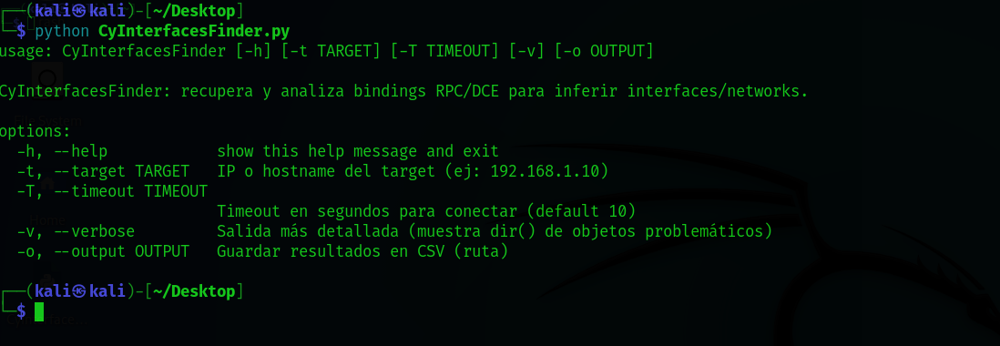
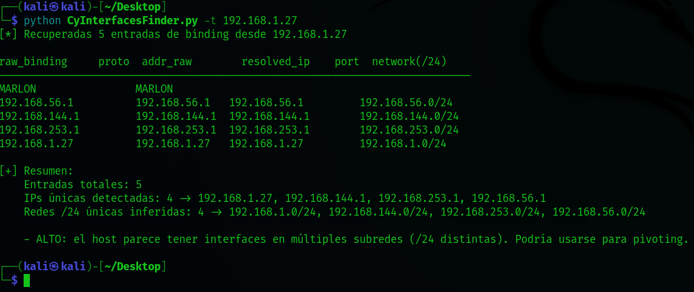

<p align="center">
  
  <strong>Español</strong>
  &nbsp;|&nbsp;
  <a href="README.en.md">
    
    <strong>English</strong>
  </a>
  &nbsp;|&nbsp;
  <a href="https://www.youtube.com/watch?v=xvFZjo5PgG0&list=RDxvFZjo5PgG0&start_radio=1&pp=ygUTcmljayByb2xsaW5nIG5vIGFkc6AHAQ%3D%3D">
    
    <strong>日本語</strong>
  </a>
</p>

# CyInterfacesFinder
CyInterfacesFinder is a Python tool that uses Impacket to query the remote RPC/DCOM service and retrieve the network interfaces advertised by the target host via `IObjectExporter::ServerAlive2()`.

---

<p align="center">
  
</p

---

## 🎥 Demonstration

<p align="center">
  
</p>

---

## Tool Screenshots

<h2 align="center">Help Panel</h2>
<p align="center">
  
</p>

<h2 align="center">Tool Launched</h2>
<p align="center">
  
</p>

<h2 align="center">Tool Results and Target Data</h2>
<p align="center">
  
</p>


## 🚀 Main Features

- Connects to the target's RPC service (binding `ncacn_ip_tcp:<target>`).  
- Calls `IObjectExporter::ServerAlive2()` to retrieve advertised bindings/addresses.  
- Robust extraction of `aNetworkAddr` from various formats (dicts with `str`/`bytes` keys, objects, `bytes`, etc.).  
- Parses bindings to extract protocol, address, IP, and port.  
- Resolves names when the binding does not contain a direct IP.  
- Infers `/24` networks as a quick heuristic to detect multiple subnets (possible pivoting).  
- `--verbose` mode that prints `type()` and `dir()` of problematic objects (helps to tune for impacket or Samba versions).  
- Option to export results to CSV with `-o/--output`.  

## 🧰 Main Options

- `-t, --target` : IP or hostname of the target (e.g., `192.168.1.10`). **Required**.  
- `-T, --timeout` : Connection timeout in seconds (default `10`).  
- `-v, --verbose` : Verbose mode (shows debug of problematic objects: `type()` and `dir()`).  
- `-o, --output` : Save results to CSV (file path).

## ⚙ Implementation detection (heuristic) ️

The tool **cannot guarantee** the implementation (Windows vs Samba).  
- If `ServerAlive2()` returns objects/attributes consistent with `STRINGBINDING` and typical Windows names → **likely Windows**.  
- If references to `samba`/`smbd` or different objects/attributes appear → **possible Samba or another implementation**.

> Optional: you can add a check that runs `nmap -sV -p135 <target>` and adds a `likely_implementation` column based on the scan result and the internal heuristic.

## Requirements

- Python 3.8+ (tested on Linux/Windows).  
- `impacket` (recommended to install in a virtualenv):  

## 📁 Project Structure

```bash
├── CyInterfacesFinder.py # Main script of the project
├── README.md # This presentation README file
```
---

## 📄 Additional Documentation

- [🤝 Code of Conduct](.github/CODE_OF_CONDUCT.md)
- [📬 How to Contribute](.github/CONTRIBUTING.md)
- [🔐 Security](.github/SECURITY.md)
- [⚠️ Legal Notice](DISCLAIMER.md)
- [📜 License](LICENSE)
- [📢 Support](.github/SUPPORT.md)

---

## ⚙️ 1.0 Basic installation by cloning on 🐧 KaliLinux 

```bash
git clone https://github.com/cyberiuscompany/CyInterfacesFinder.git
cd CyInterfacesFinder
python3 -m venv venv (This command is optional)
source venv/bin/activate (This command is optional)
pip install impacket
python CyInterfacesFinder.py
```
> Important note: This tool makes RPC/DCE calls against a remote host. Use it only on systems you control or with written authorization from the owner. Unauthorized use may be illegal.
