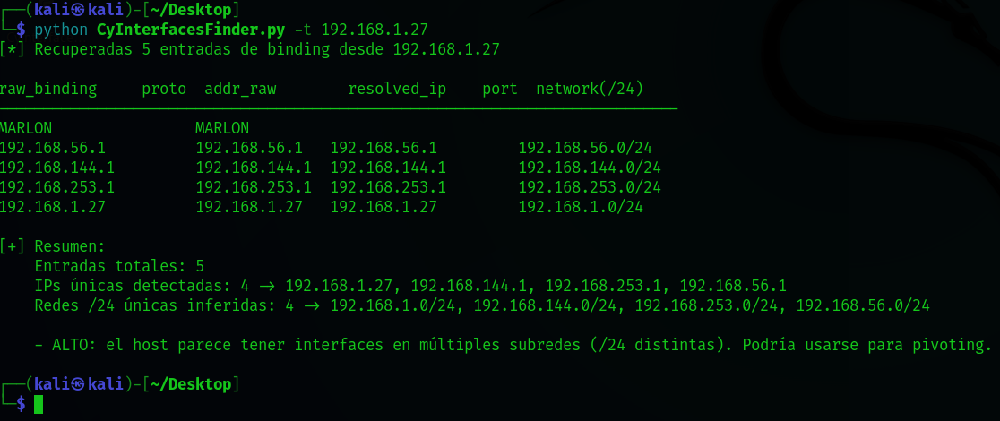

<p align="center">
  
  <strong>Español</strong>
  &nbsp;|&nbsp;
  <a href="README.en.md">
    
    <strong>English</strong>
  </a>
  &nbsp;|&nbsp;
  <a href="https://www.youtube.com/watch?v=xvFZjo5PgG0&list=RDxvFZjo5PgG0&start_radio=1&pp=ygUTcmljayByb2xsaW5nIG5vIGFkc6AHAQ%3D%3D">
    
    <strong>日本語</strong>
  </a>
</p>

# CyInterfacesFinder
CyInterfacesFinder es una herramienta en Python que utiliza Impacket para consultar el servicio RPC/DCOM remoto y recuperar las interfaces de red anunciadas por el host objetivo mediante `IObjectExporter::ServerAlive2()`

---

<p align="center">
  
</p

---

## 🎥 Demostración

<p align="center">
  
</p>

---

## Fotos de Herramienta

<h2 align="center">Panel de Help</h2>
<p align="center">
  
</p>

<h2 align="center">Herramienta Lanzada</h2>
<p align="center">
  
</p>

<h2 align="center">Resultados de Herramienta y Datos del "Target"</h2>
<p align="center">
  
</p>


## 🚀 Funcionalidades principales

- Conecta al servicio RPC del objetivo (binding `ncacn_ip_tcp:<target>`).  
- Llama a `IObjectExporter::ServerAlive2()` para recuperar bindings/direcciones anunciadas.  
- Extracción robusta de `aNetworkAddr` desde distintos formatos (dict con keys `str`/`bytes`, objetos, `bytes`, etc.).  
- Parsea bindings para extraer protocolo, dirección, IP y puerto.  
- Resuelve nombres cuando el binding no contiene IP directa.  
- Inferencia de redes `/24` como heurística rápida para detectar múltiples subredes (posible pivoting).  
- Modo `--verbose` que imprime `type()` y `dir()` de objetos problemáticos (ayuda a ajustar para versiones de `impacket` o Samba).  
- Opción de exportar resultados a CSV con `-o/--output`.  

## 🧰 Opciones Principales

- `-t, --target` : IP o hostname del objetivo (ej: `192.168.1.10`). **Requerido**.  
- `-T, --timeout` : Timeout en segundos para la conexión (por defecto `10`).  
- `-v, --verbose` : Modo detallado (muestra debug de objetos problemáticos: `type()` y `dir()`).  
- `-o, --output` : Guardar resultados en CSV (ruta del fichero).

## ⚙ Detección de implementación (heurística) ️

La herramienta **no puede garantizar** la implementación (Windows vs Samba).  
- Si `ServerAlive2()` devuelve objetos/atributos consistentes con `STRINGBINDING` y nombres típicos de Windows → **probable Windows**.  
- Si aparecen referencias a `samba`/`smbd` u objetos/atributos distintos → **posible Samba u otra implementación**.

> Opcional: puedes añadir una comprobación que ejecute `nmap -sV -p135 <target>` y añada una columna `likely_implementation` basada en el resultado del escaneo y la heurística interna.

## Requisitos

- Python 3.8+ (probado en entornos Linux/Windows).  
- `impacket` (recomendado instalar en un virtualenv):  

## 📁 Estructura del proyecto

```bash
├── CyInterfacesFinder.py # Script principal del proyecto
├── README.md # Este fichero de lectura de presentación de la herramienta
```
---

## 📄 Documentación adicional

- [🤝 Código de Conducta](.github/CODE_OF_CONDUCT.md)
- [📬 Cómo contribuir](.github/CONTRIBUTING.md)
- [🔐 Seguridad](.github/SECURITY.md)
- [⚠️Aviso legal](DISCLAIMER.md)
- [📜 Licencia](LICENSE)
- [📢 Soporte](.github/SUPPORT.md)

---

## ⚙️ 1.0 Instalación básica con clonado en 🐧 KaliLinux 

```bash
git clone https://github.com/cyberiuscompany/CyInterfacesFinder.git
cd CyInterfacesFinder
python3 -m venv venv (No es obligatorio este comando)
source venv/bin/activate (No es obligatorio este comando)
pip install impacket
python CyInterfacesFinder.py
```
> Nota importante: Esta herramienta realiza llamadas RPC/DCE contra un host remoto. Úsala solo en sistemas bajo tu control o con autorización escrita del propietario. El uso no autorizado puede ser ilegal.


